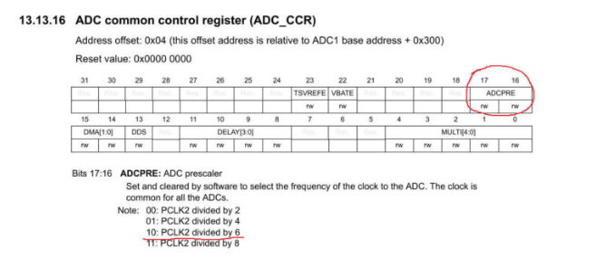

## ADC INTERFACE USING STM32 WITH REGISTERS 

ADC interface with DMA with STM32 using registers .
- I am choosing ADC for this tutorial because the conversion of these values will take place in the background, without affecting the CPU, and whenever we need the ADC value for some processing, we can just take it from the buffer.
This way we will always get the latest value from the ADC.

### STEPS TO FOLLOW 

1. Enable ADC and GPIO clock
2. Set the prescalar in the Common Control Register (CCR)
3. Set the Scan Mode and Resolution in the Control Register 1 (CR1)
4. Set the Continuous Conversion, EOC, and Data Alignment in Control Reg 2 (CR2)
5. Set the Sampling Time for the channels in ADC_SMPRx
6. Set the Regular channel sequence length in ADC_SQR1
7. Set the Respective GPIO PINs in the Analog Mode


####  Enable ADC and GPIO clock 

> I am using multiple channels for ADC1 in this tutorial. To be precise, I am going to use channel 1 and channel 4.

Channel is is connected to the PA1 and channel 4 is connected to PA4

So I would need to enable the GPIOA clock here.

Enable clocks

```
RCC->APB2ENR |= (1<<8);  // enable ADC1 clock
RCC->AHB1ENR |= (1<<0);  // enable GPIOA clock
```

#### Set the prescalar in the Common Control Register (CCR)

> In this case, the ADC1 is connected to the APB2 Peripheral clock, which is running at it’s maximum speed of 90 MHz

We will use the prescalar to bring the ADC1 clock down.

The Prescalar selection can be done in the CCR Register. The important point to note here is that we can only choose amongst the predefined Prescalar values. This is shown in the figure below




