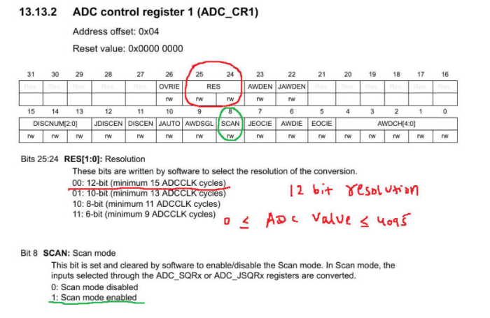

## ADC INTERFACE USING STM32 WITH REGISTERS 

ADC interface with DMA with STM32 using registers .
- I am choosing ADC for this tutorial because the conversion of these values will take place in the background, without affecting the CPU, and whenever we need the ADC value for some processing, we can just take it from the buffer.
This way we will always get the latest value from the ADC.

### STEPS TO FOLLOW 

1. Enable ADC and GPIO clock
2. Set the prescalar in the Common Control Register (CCR)
3. Set the Scan Mode and Resolution in the Control Register 1 (CR1)
4. Set the Continuous Conversion, EOC, and Data Alignment in Control Reg 2 (CR2)
5. Set the Sampling Time for the channels in ADC_SMPRx
6. Set the Regular channel sequence length in ADC_SQR1
7. Set the Respective GPIO PINs in the Analog Mode


####  Enable ADC and GPIO clock 

> I am using multiple channels for ADC1 in this tutorial. To be precise, I am going to use channel 1 and channel 4.

Channel is is connected to the PA1 and channel 4 is connected to PA4

So I would need to enable the GPIOA clock here.

Enable clocks

```
RCC->APB2ENR |= (1<<8);  // enable ADC1 clock
RCC->AHB1ENR |= (1<<0);  // enable GPIOA clock
```

#### Set the prescalar in the Common Control Register (CCR)

> In this case, the ADC1 is connected to the APB2 Peripheral clock, which is running at it’s maximum speed of 90 MHz

We will use the prescalar to bring the ADC1 clock down.

The Prescalar selection can be done in the CCR Register. The important point to note here is that we can only choose amongst the predefined Prescalar values. This is shown in the figure below


```
//2. Set the prescalar in the Common Control Register (CCR)	
ADC->CCR |= 2<<16;  		 // PCLK2 divide by 6.... ADC_CLK = 90/6 = 15MHz
```

- Here I have used the presclalar of 6, so the ADC clock = 90/6 = 15 MHz.


#### Set the Scan Mode and Resolution in the Control Register 1 (CR1) 

> Now we will modify the Control Register 1 (CR1). Here we will set up the scan mode and the Resolution for the ADC1.

1. Scan mode must be set, if you are using more than 1 channel for the ADC.
2. Resolution defines the Resolution of the ADC. In STM32F4, this can vary between 6-Bit, 8-Bit, 10-Bit or 12-Bit.



> Here choosing the Resolution of 12 bit means, the ADC values will vary between 0 to 4095.

```
//3. Set the Scan Mode and Resolution in the Control Register 1 (CR1)	
ADC1->CR1 = (1<<8);    // SCAN mode enabled
ADC1->CR1 &= ~(1<<24);   // 12 bit RES
```
#### Set the Continuous Conversion, EOC, DMA and Data Alignment in Control Reg 2 (CR2)

> We have to modify the Control Register 2 in order to set all the things mentioned here.

- Continuous Conversion specifies whether we want to convert the ADC values continuously, or should it stop after one conversion only.
- EOC is End Of Conversion specifies whether the EOC Flag should set after each conversion, or at the end of all the conversions.
- DMA specifies whether we want to use DMA for ADC.
- Data Alignment specifies whether the 12 bit data should be Right Aligned or Left Aligned in a 16 bit Register.


```
//4. Set the Continuous Conversion, EOC, and Data Alignment in Control Reg 2 (CR2)
ADC1->CR2 = (1<<1);     // enable continuous conversion mode
ADC1->CR2 |= (1<<10);    // EOC after each conversion
ADC1->CR2 &= ~(1<<11);   // Data Alignment RIGHT
// Enable DMA for ADC
ADC1->CR2 |= (1<<8);
// Enable Continuous Request
ADC1->CR2 |= (1<<9);
```

1. Here I am choosing the Continuous Mode, so that the conversion would not stop.
2. EOC will be set after each conversion
3. Data Alignment will be to the right
4. Enable the DMA mode, as we will be using DMA in this tutorial
5. The DMA requests will be continuous, and they will only disable, if the DMA itself is disabled


